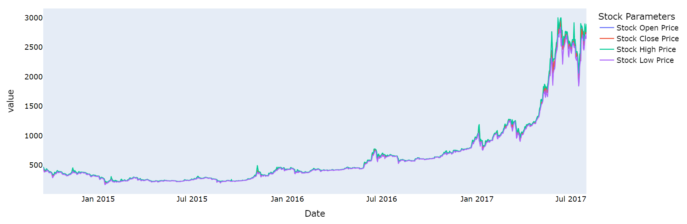

# Bitcoin_analysis
## Problem Statement
* Bitcoin dataset is provided, where the data of year 2013-2017 is given. There are columns like
Open, Close, High, Low, Volume, Market Capitalization.
* We’re supposed to do future prediction of all columns using the dataset.
* Open is the price of the stock at the beginning of the trading day (it need not be the closing price of the previous trading day), High is the highest price of the stock on that trading day, Low the lowest price of the stock on that trading day, and Close the price of the stock at closing time.

                         

## Stock Analysis

## Models Implemented
* Random-Forest Regressor
* Linear Regressor

## Mean Squared Error and R2-score for Random Forest Regressor
| Metric| Close | Open | High | low | Volume| Market Capitallization|
| :---: | :---: | :---: | :---: | :---: | :---: |:---:|
| R2-score | 0.975 | 0.976 |0.983| 0.980 |0.781| 0.967|
| MSE| 0.0024|0.0022|0.0017|0.0029|0.011|0.003|

## Mean Squared Error and R2-score for Linear Regressor
| Metric| Close | Open | High | low | Volume| Market Capitallization|
| :---: | :---: | :---: | :---: | :---: | :---: |:---:|
| R2-score | 0.984 | 0.984 |0.983| 0.983 |0.818| 0.985|
| MSE| 0.0016|0.0016|0.0018|0.0015|0.009|0.0015|

<!-- 0.983889	0.983856	0.983137	0.983107	0.818603	0.984264
Mean-squared-error	0.001572	0.001574	0.001816	0.001630	0.009467	0.001548 -->